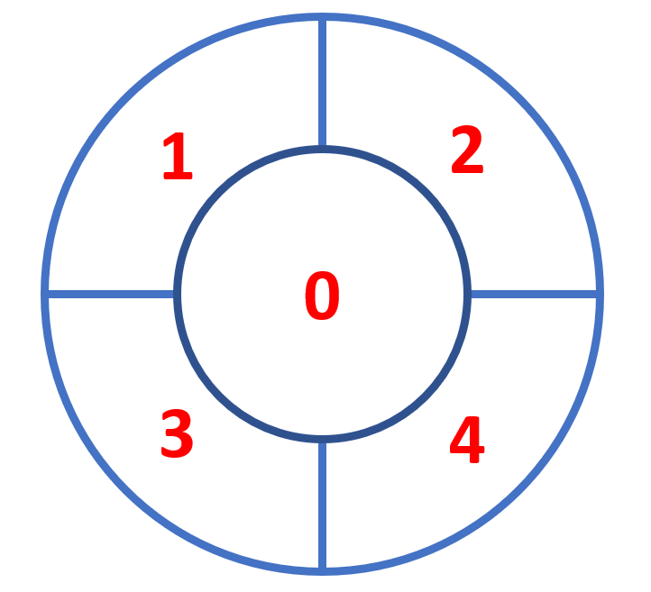

# CFUCounter

An application that counts colony-forming units in images of petri dishes. CFU Counter uses Mask R-CNN which is a
state-of-the-art model for instance segmentation, developed on top of Faster R-CNN. The CNN was trained using the Agar dataset.

https://github.com/matterport/Mask_RCNN

https://agar.neurosys.com/

## Instructions:
<ol>
<li><b>Download .h5 file from this link</b>: https://drive.google.com/file/d/19-mxrjV_EeSQAb7SppIVG_vgjse_pP7u/view?usp=sharing</li>
  
<li>Put .h5 file to <b>"agar_cfg20221010T2320"</b> folder</li>

<li>Create an environment with <b>Python 3.6.3</b> and install dependencies with the following commands in terminal/powershell:</li>

<ol>
  <li>conda create -n agarrcnn python=3.6.3</li>

  <li>conda activate agarrcnn</li>

  <li>pip install -r requirements.txt</li>
</ol>
</ol>

## To run the application:

python cfucounter.py

<h2>Upload a file</h2>
<ul><li>
To upload a single image use the "Upload File" button.
</li>
    <li>
To upload all images from a folder use the "Upload Folder" button.
</li>
</ul>

<h2>Set configurations</h2>
<ol>
<li>
Set <b>Number of Samples</b>, the maximum number of final detections. If you don't know the estimated number of colonies, leave this number high.
</li>
<li>
Set <b>Detection Confidence</b>, minimum probability value to accept a detected instance. ROIs below this threshold are skipped. For the best results raise its value to 0.99. If you have a vague picture and you think that the application underestimates the number of colonies you can leave the default number or decrease it.
</li>

Or just leave the default parameters.

</ol>

Hint: you can run the detection multiple times on the same image with different configuration parameters. All the input configuration parameters are saved in the output .csv table.

<h2>Run Detection</h2>
<ul>
<li>

Click <b>"Detect selected"</b> to detect colonies on the displayed image. The detection will be performed on the picture that is shown in the main window. To change the picture use arrow buttons near thumbnails of images.
</li>
<li>
Click <b>"Detect all"</b> to detect colonies in all the uploaded images.
</li>
</ul>
<h2>Export results</h2>
<ul>
<li>
Click <b>"Export csv table"</b> after the detection process to save a table containing information: img name, number of colonies, bounding boxes (rectangles that surround colonies, that specify their position).

Please always export the table before closing the application!

</li>

<table class="fl-table">
    <thead>
      <tr>
        <th>Filename</th>
        <th>Number of colonies</th>
        <th>Bounding boxes</th>
        <th>conf_numsamples</th>
        <th>conf_det_confidence</th>
        <th>Colonies per sector</th>
      </tr>
    </thead>
    <tbody>
      <tr>
        <td>Filename</td>
        <td>Number of detected colonies</td>
        <td>Coordinates of colonies as boxes</td>
        <td>Max. number of samples</td>
        <td>Min. detection confidence</td>
        <td>Number of colonies in each sector</td>
      </tr>
    </tbody>
    </table>

Sectors represent certain areas of the petri dish:

<li>
Click <b>"Export image"</b> to save displayed image.
</li>
</ul>
<h2>Information</h2>

<b>Progress bar</b> shows percentage-wise progress of a current detection process. For a large number of images, it does not update itself consistently.

In the bottom part of the application there is <b>log window</b> capturing all the events.

</body>

## Author
Ekaterina Baikova, TU Graz, 2022

